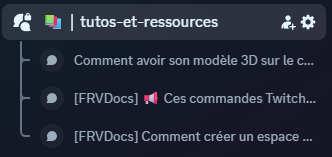
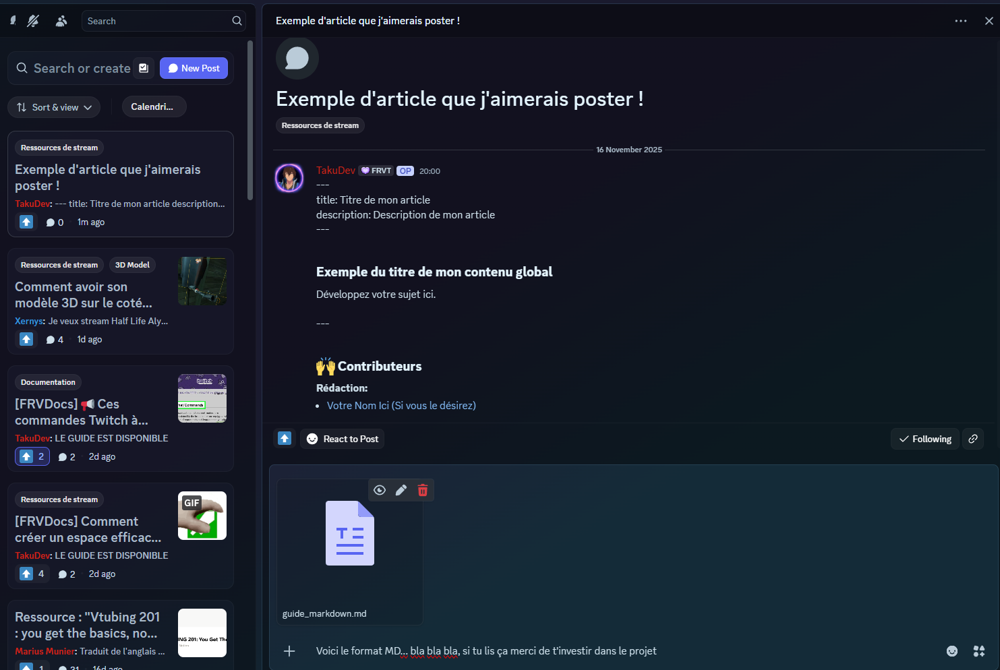

# Comment rédiger un article pour FRVDocs ?

Ce guide explique les outils, les bases du Markdown afin de permettre à chacun d'écrire simplement et proprement ses articles avant de les envoyer sur **Discord**. 

Nous comptons sur votre soutiens pour proposer des documents à la communauté et ainsi figurer parmis les contributeurs présents sur le site. (Chaque article rédigé aura un crédit de votre nom ainsi que le lien sur un de vos réseaux).

## ✨ C'est quoi le principe du format Markdown ?

Le **Markdown** est un langage de mise en forme léger.\
Il permet d'écrire du texte lisible même sans mise en forme tout en offrant des éléments comme des titres, listes, images, mises en gras..etc.

ℹ️ À titre informatif, vous l'avez forcément utiliser sur l'application Discord, qui utilise ce format pour ces messages

## 🧱 Les bases du Markdown

### 1. Titres

``` md
# Titre niveau 1
## Titre niveau 2
### Titre niveau 3
```

### 2. Texte en gras / italique

``` md
**Texte en gras**
*Texte en italique*
~~Texte barré~~
```

### 3. Listes

-   Liste simple :

``` md
- Élément
- Élément
```

-   Liste numérotée :

``` md
1. Premier
2. Deuxième
```

### 4. Bloc de citation

``` md
> Ceci est une citation
```

### 5. Code

-   En ligne :

``` md
`code`
```

-   Bloc :

```{=html}
<!-- -->
```
    du code ici

### 6. Liens

``` md
[Texte du lien](https://exemple.com)
```

### 7. Images

``` md

```

## 🧰 Logiciels conseillés pour écrire en Markdown

### Les logiciels gratuits
#### En ligne
- StackEdit (Gratuit)  
https://stackedit.io
- Markdownlivepreview (Gratuit)  
https://markdownlivepreview.com/
- Editor.md (Gratuit)  
https://pandao.github.io/editor.md/en.html

#### En application
- MarkText (Gratuit)
https://github.com/marktext/marktext
- Visual Studio Code (Gratuit)  
https://code.visualstudio.com/
- Zettlr (Gratuit)  
https://www.zettlr.com/

### Les logiciels payants
- Typora (Payant, 14.99$)
https://typora.io/

## 📤 Comment envoyer ton article pour FRVDocs ?



1.  Rédige ton article.
2.  Vérifie la mise en forme.
3.  Envoie le contenu de ton `.md` sur Discord et ajoute ton fichier .md en pièce jointe dans le post.

**Exemple de la rédaction d'un article:**


## 📎 Modèle simple

``` md

---
title: Titre de mon article
description: Description de mon article
---

## Exemple du titre de mon contenu global
Développez votre sujet ici.

---

## 🙌 Contributeurs
**Rédaction:** 
- [Votre Nom Ici (Si vous le désirez)](https://monlienincroyable.com/)
```
