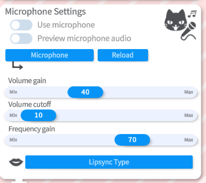
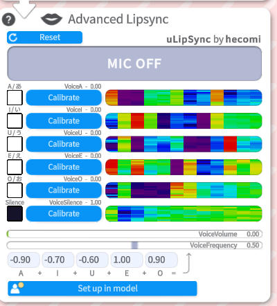

## Un résumé de ce qu'est les paramètres LipSync sur VTube Studio

#### Paramètre du microphone

  

Tu peux paramétrer ton microphone sur VTube Studio ici ! Clique sur **Microphone** et sélectionne le micro que tu désires mettre en place. Pour **activer le microphone**, il te suffira juste d'activer "Use Microphone" par la suite.

Tu peux régler sur l'application:
- Le gain de volume:\
Si tu parles trop fort ou que le micro sature sur la preview, diminue le gain et à l'inverse, si tu parles trop doucement, tu peux l'augmenter.
- Le seuil du volume (Volume Cutoff):\
C'est le seul à partir du moment où tu modèle considère que tu es en train de parler. Si c'est trop bas, le lipsync bougera même avec du bruit de fond, si c'est trop haut, le lipsync ne s'activera que lorsque tu parles très fort. Cela permet d'ignorer le bruit de fond sur le microphone.
- Le gain de fréquence (Frequency gain):\
C'est utilise si ton micro manque de détection sur les aigus ou, à l'inverse, possède un son trop clair.
Un réglage plus élevé peux aider à distinguer les mouvements de bouche.

#### Gestion Avancée du LipSync

Ce module permet à VTube Studio d'analyser ta voix pour calculer la forme que devrais prendre la bouche en considération.
Dépendant de comment tu as configuré VTube Studio, tu peux aussi tracker ta bouche avec le tracking de la caméra ou téléphone.

Clique sur "LipSync Type", Tu peux choisir entre deux types de LipSync:
- LipSync Simple:\
  Uniquement pour Windows, l'option est basée sur [Occulus VR Lipsync](https://developers.meta.com/horizon/documentation/unity/audio-ovrlipsync-unity/?locale=fr_FR). \
  **⚠️ Feature dépréciée**, VTube studio souhaite que les utilisateurs utilisent le **LypSync Avancée** car ils prends les mêmes paramètres (et plus) avec une meilleure précision.

- LipSync avancée:\
  Basé sur [uLipSync par hecomi](https://github.com/hecomi/uLipSync). \
  Ce mode est rapide et précis, peut être calibré avec votre propre voix pour détecter avec exactitude les phonèmes **A, I, U, E, O**  C'est disponible de base sur toutes les plateformes (ordinateur et smartphone)

## Calibration du LipSync avancée sur VTube Studio

ℹ️ Si votre microphone subit du **latences** ou **saccades**, utilisez le bouton **Reload** ou configurez un **hotkey** dédié.

**Pour calibrer les voyelles :** 
- Cliquez sur **Calibrate** pour chaque voyelle.
- Prononcez la voyelle correspondante durant tout le processus.
- Répétez la calibration si vous changez de micro ou de configuration audio.

Vous pouvez cliquer sur **Reset** pour revenir aux valeurs par défaut.

Vérifiez ensuite que chaque voyelle détectée s'allume correctement dans l'interface.

Les visualisations colorées à côté des boutons montrent le spectre fréquentiel enregistré lors de la calibration.

## Quelques détails sur le suivi vocal (Voice Tracking)

Ces paramètres peuvent être reliés à **n'importe quel paramètre Live2D**, pas seulement la bouche.

**Paramètres disponibles :**
- **VoiceA / VoiceI / VoiceU / VoiceE / VoiceO (0--1)**\
Niveau de détection de chaque voyelle.
- **VoiceSilence (0--1)**\
Vaut 1 quand un silence est détecté (volume très faible).
- **VoiceVolume / VoiceVolumePlusMouthOpen (0--1)**\
Niveau du volume sonore détecté.
- **VoiceFrequency / VoiceFrequencyPlusMouthSmile (0--1)**\
Alternative si votre modèle ne possède qu'un seul paramètre de forme de bouche.

## Comment bien tester mon LipSync sur VTube Studio ?

L'équipe de VTube Studio de DenchiSoft as mis en place un modèle de bouche Live2D. \
Ce modèle prend en charge tous les paramètres lié au LipSync, la combinaison Caméra/Phone avec microphone. \
Il peut être utilisé pour tester les fonctionnalités ou servir de référence pour votre propre modèle pour les riggers.\

Le modèle est **gratuit** : [LipSync Example by VTube Studio](https://raw.githubusercontent.com/wiki/DenchiSoft/VTubeStudio/data/aaa_BlendshapeMouthExample.zip)

Le principe :
- Quand un son est détecté : la bouche utilise les **blendshapes basés
sur les voyelles**.\
- Quand il n'y a pas de son : la bouche revient au tracking
**Webcam/IPhone**.

### Paramètres typiques de l'example LipSync:

-   `ParamMouthOpen`
-   `ParamMouthForm`
-   `ParamSilence` (lié à `VoiceSilence`)
-   `ParamA`, `ParamI`, `ParamU`, `ParamE`, `ParamO` (vos blendshapes)

`ParamSilence` doit ramener la bouche au neutre quand le son est
détecté.

---

## Limitations techniques

-   Le tracking audio remplace presque totalement le tracking caméra quand un son est détecté.
-   Impossible d'avoir des voyelles *heureuses*/*tristes* via blendshapes distincts sans setup complexe.
-   Les sons comme « mmm » ouvrent la bouche car une voyelle est détectée.

## 📄 Fin du tutoriel
Tu sais enfin tout sur le LipSync sur Vtube Studio !\
[Tu peux reprendre la suite du guide d'installation si tu le souhaites](/docs/logiciels-2d/vtube-studio/installation-presentation-vtube-studio#intégration-twitch-déclencher-des-hotkeys-via-des-redeems)

---

## 📚 Sources & Bibliographie

### Documentation officielle
- **Wiki** - *Documentation anglaise de VTube Studio par DenchiSoft*  
https://github.com/DenchiSoft/VTubeStudio/wiki

---

## 🙌 Contributeurs
**Rédaction:** 
- [TakuDev](https://www.twitch.tv/takudev)
