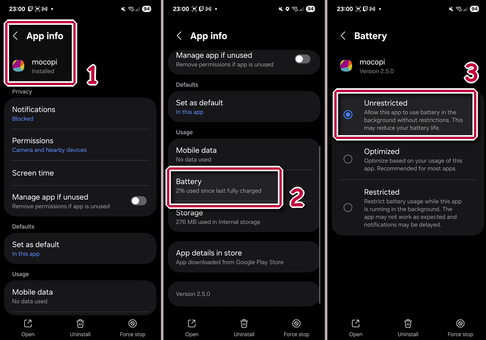

## Un résumé de ce qu'est l'intégration de Mocopi sur VTube Studio

ℹ️ À l'heure actuel, le support de cette technologie côté Mocopi ou VTube Studio est uniquement très présent pour **les Japonais et Chinois**. Merci de le prendre en compte lors de l'usage de cette technologie.

Ce module VTube Studio permet de capturer les mouvements de ton corps dans VTube Studio à l'aide du tracker mocopi de Sony. VTube Studio convertit facilement les mouvements 3D de ton corps en paramètres pour le modèles Live 2D.\
Cela inclut les mouvements du corps, de la tête, des jambes, des bras et des mains. 

**⚠️ VTube Studio peut recevoir et utiliser les données Mocopi uniquement sous Windows et macOS.**

---

## ❓ Comment intégrer Mocopi à Vtube Studio ?

> Un grand merci à guide officiel japonais de Sony, toutes les images proviendront de ce [guide japonais](https://www.sony.co.jp/en/Products/mocopi-dev/jp/documents/VTubeStudio/mocopi_VTubeStudio_HowTo.html)

L'équipe mocopi de Sony as mis en place un modèle Live2D configuré pour VTube Studio. Ce modèle prend en charge tous les paramètres mocopi et peut être utilisé pour tester les fonctionnalités mocopi ou servir de référence pour votre propre modèle pour les riggers.\
Le modèle est **gratuit** : [RAYNOS-chan-avatar_for_VTubeStudio](https://www.sony.co.jp/en/Products/mocopi-dev/jp/downloads/DownloadInfo.html#RAYNOS)

Selon Sony, ce modèle peut être utilisé librement pour les diffusions, mais certaines restrictions peuvent s'appliquer. Oublies pas de lire le contrat de licence d'utilisation du personnage avant de le télécharger.

---

## 🛠️ Configuration du Mocopi

La première étape consiste à configurer Mocopi et à envoyer
les données vers VTube Studio. L'appareil Mocopi ne peut pas se
connecter directement à VTube Studio. Vous devez utiliser l'application
iOS/Android ou l'application PC Windows.

### Les avantages de l'application iOS/Android Mocopi

-   Fonctionne sur smartphone et reçoit les données des trackers
    mocopi.
-   Ensuite, elle envoie les données à VTube Studio via le réseau local/Wi-Fi.
-   L'application smartphone est gratuite.

**Plus d'informations :** \
[Envoyer des données depuis Mocopi iOS/Android (En Anglais)](https://www.sony.co.jp/en/Products/mocopi-dev/en/documents/ReceiverPlugin/SendData.html).

### Les avantages de l'application PC Mocopi

-   Fonctionne directement sur PC et reçoit les données des trackers
    mocopi.
-   Doit être connectée via le receveur de données mocopi ou
    l'application mocopi link.
-   Envoie ensuite les données à VTube Studio via le réseau local
    (fonctionne aussi sur le même PC).
-   Un abonnement mensuel est requis.

**Plus d'informations :** \
[Comment utiliser l'application PC mocopi (En Anglais)](https://www.sony.co.jp/en/Products/mocopi-dev/en/documents/mocopiPC/HowTo_mocopiPC.html).

En général, l'utilisation de ces applications est similaire : connectez
l'appareil mocopi, puis configurez la connexion vers VTube Studio.\
Dans les paramètres mocopi de VTube Studio, vérifiez l'adresse IP et le
port sélectionné.\
Ensuite, entrez cette adresse IP et ce port dans les paramètres de
connexion tierce de l'application mocopi.

Cliquez ensuite sur **"Démarrer l'envoi des données"** dans
l'application mocopi, et assurez-vous que le récepteur mocopi est activé dans VTube Studio.

La connexion sera alors établie et les données mocopi seront utilisables dans VTube Studio.

---

## 🙍 Paramètres pris en charge

Par défaut, VTube Studio masque les paramètres de suivi mocopi dans la liste des paramètres lors de la configuration du modèle.\
Si vous utilisez mocopi, activez **"Afficher les paramètres de suivi"**
dans les paramètres mocopi de VTube Studio.

### Remarque importante sur les plages de paramètres

Les plages indiquées ci-dessous sont les valeurs min/max par défaut utilisées lorsque VTube Studio crée une nouvelle correspondance de paramètres.

Certains paramètres (comme *MocopiAngleX*) peuvent dépasser ces
valeurs.\
Les paramètres ayant une plage \[-180, 180\] ne peuvent pas dépasser ces limites : lorsqu'ils atteignent une extrémité, ils "bouclent" vers l'autre côté (rotation 360°).

Pour comprendre en détail les valeurs des paramètres, consultez le modèle Live2D fourni par Sony.

### Liste des paramètres mocopi dans VTube Studio

-   **MocopiConnected**\
    Plage : \[0, 1\]\
    0 si VTube Studio ne reçoit pas de données, 1 si les données mocopi
    sont reçues.

-   **MocopiHipAngleZ**\
    Plage : \[-30, 30\]\
    Inclinaison du bassin (gauche/droite).

-   **MocopiAngleX**\
    Rotation gauche/droite de la tête

-   **MocopiAngleY**\
    Rotation haut/bas de la tête

-   **MocopiAngleZ** :\
    Inclinaison de la tête\
    (Plage pour chacun : \[-30, 30\])

-   **MocopiBodyAngleX/Y/Z**\
    Plage : \[-10, 10\]\
    Rotations du corps.

-   **MocopiBodyPositionX/Y/Z**\
    Plage : \[-1, 1\]\
    Position absolue du corps.

-   **MocopiUpperArmLeftAngleY / RightAngleY**\
    Plage : \[-90, 90\]\
    Rotation avant/arrière du bras.

-   **MocopiUpperArmLeftAngleZ / RightAngleZ**\
    Plage : \[-180, 180\]\
    Rotation verticale du bras (360°).

-   **MocopiLowerArmLeftAngleX / RightAngleX**\
    Plage : \[-180, 180\]\
    Rotation du poignet (360°).

-   **MocopiLowerArmLeftAngleY / RightAngleY**\
    Plage : \[-90, 90\]\
    Rotation avant/arrière de l'avant-bras.

-   **MocopiLowerArmLeftAngleZ / RightAngleZ**\
    Plage : \[-180, 180\]\
    Flexion de l'avant-bras.

-   **MocopiUpperLegLeftAngleY / RightAngleY**\
    Plage : \[-30, 30\]\
    Rotation avant/arrière de la cuisse.

-   **MocopiUpperLegLeftAngleZ / RightAngleZ**\
    Plage : \[-30, 30\]\
    Rotation gauche/droite de la cuisse.

-   **MocopiLowerLegLeftAngleY / RightAngleY**\
    Plage : \[-30, 30\]\
    Rotation avant/arrière du tibia.

-   **MocopiLowerLegLeftAngleZ / RightAngleZ**\
    Plage : \[-30, 30\]\
    Rotation gauche/droite du tibia.

---

## 📷 Combinaison avec Webcam / iOS / Android

Si le récepteur mocopi est désactivé dans VTube Studio ou si aucune donnée n'est reçue, les paramètres utilisent automatiquement le suivi de la tête provenant de la webcam ou du smartphone.\
Lorsque la réception mocopi s'arrête, tous les paramètres reviennent automatiquement à 0.

---

## 📎 Dépannage & FAQ

### Plusieurs trackers mocopi envoient des données. Que se passe‑t‑il ?

VTube Studio ne peut recevoir les données que d'un seul tracker à la
fois. Les données supplémentaires sont ignorées.

### L'application mocopi s'arrête en arrière‑plan sur Android

Certaines versions Android limitent l'accès Bluetooth ou réseau des apps
en arrière‑plan pour économiser l'énergie.\
Désactivez toutes les options d'économie d'énergie pour l'application
mocopi et autorisez son fonctionnement en arrière‑plan.

## 📄 Fin du tutoriel
Tu sais enfin tout sur Mocopi sur Vtube Studio !\
[Tu peux reprendre la suite du guide d'installation si tu le souhaites](/docs/logiciels-2d/vtube-studio/installation-presentation-vtube-studio#-model-configuration)

---

## 📚 Sources & Bibliographie

### Documentation officielle
- **Wiki** - *Documentation anglaise de VTube Studio par DenchiSoft*  
https://github.com/DenchiSoft/VTubeStudio/wiki

---

## 🙌 Contributeurs
**Rédaction:** 
- [TakuDev](https://www.twitch.tv/takudev)
