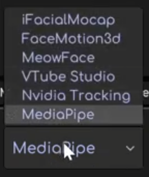
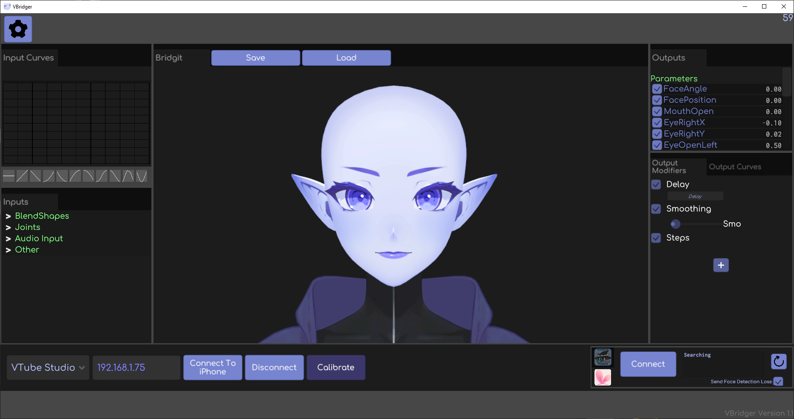
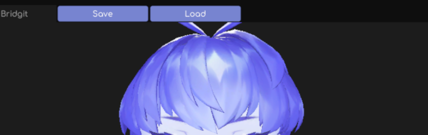
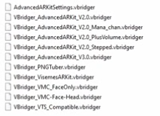

### Version vidéo
**(non-officiel à FRVDocs, vidéo de la communauté)**

  

    <iframe
      src="https://www.youtube.com/embed/Qwz-22_s7WY"
      title="Commandes sur twitch"
      allow="accelerometer; autoplay; clipboard-write; encrypted-media; gyroscope; picture-in-picture"
      allowfullscreen
      style={{
        border: 0,
        position: 'absolute',
        top: 0,
        left: 0,
        width: '100%',
        height: '100%',
      }}>
    </iframe>
  

## 🧩 Prérequis avant utilisation de VBridger

-   **Un modèle Live2D** riggé pour **VBridger**\
⚠️ Il y a des paramètres dédiés à VBridger que le créateur du modèle as du mettre en place pour que ça fonctionne bien avec.
-   **Un système de tracking compatible :**
    - IPhone avec ARKit (iFacial Mocap, FaceMotion3D, MeowFace, etc.)
    - Webcam + MediaPipe
    - Android (Meowface par exemple)

ℹ️ N'oubliez pas d'avoir bien autorisé VBridger à **VTube Studio** avant !

---

## 📱 Connexion avec un IPhone (ARKit), Android ou tout simplement une caméra

Ouvres ton application de tracking et **copie l'adresse IP**.
Elle s'affiche souvent directement dans l'application ou dans les paramètres de ton téléphone.

\

### Connecter ton téléphone ou caméra à VBridger

-   Ouvre VBridger
-   Sélectionnez votre logiciel de tracking
-   Entrez l'adresse IP à côté de votre logiciel de tracking
-   Cliquez sur **Connect to iPhone**

> Si la tête sur VBridger bouge : **la connexion entre ton téléphone et VBridger est faite !**

ℹ️ Si le tracking te semble regarder de côté, tu peux cliquer sur **Calibrate**.

⚠️ **CONCERNANT LA CAMÉRA**, elle ne supporte pas certains mouvement comme la bouche en canard, la machoire ouverte est supporté de manière limitée.

### Connecter VBridger à VTube Studio

-   Dans VTube Studio, active le support des plugins
-   Retournez dans VBridger et cliques sur **Connect**
-   **Si c'est la 1ère fois**, accepte la fenêtre popup qui te demande la permission à VBridger de se connecter à VTube Studio

> Tu as maintenant relié **VBridger à VTube Studio** ! 🎉

---

## ⚙ Les Presets VBridger 

C'est La façon la plus **rapide & commune** pour paramétrer VBridger !

Dans VBridger, tu peux charger des présets déjà existant dans **Load** pour te simplifier la taches. Plusieurs paramètres sont dédiés pour une tâche particulières mais voici quelques presets sur lesquels s'arrêter:
- **AdvancedARKitSettings.vbridger**\
Chargé par défaut 
- **VBridger_AdvancedARKit_2.0.vbridger**\
Version plus réactif/sensible 
- **VBridger_AdvancedARKit_3.0.vbridger**\
Version encore plus sensible au tracking

ℹ️ N'hésites pas à essayer plusieurs paramètres de trackings pour voir ce qui conviendrais mieux à toi et à ton modèle.

---

## Les paramètres à modifier sur VTube Studio

Chaques paramètres VTube Studio a un **Input** (ce que votre visage envoie) et un **Output** (ce que Live2D reçoit).

Le fais que vous utiliser VBridger, vous devez **absoluement** régler la valeur Input Max et Input Min pour que les paramètres suivent le tracking VBridger.

Pour savoir comment fonctionne le **système de paramètre sur VTube Studio**, veuillez vous référer au [guide d'installation](/docs/logiciels-2d/vtube-studio/installation-presentation-vtube-studio) qui vous explique de manière complète VTube Studio.

### Exemple de cas de figure, la bouche ouverte (mouthOpen)
1. Ouvrez votre bouche et notez la valeur (exemple: 0.92)\
2. Mettez-la dans l'Input Max.
3. Le smoothing, par défaut à 0, permet de lisser le mouvement.\
À noter que cela **peux provoquer un délai** et que modifier autre que 0 pour lisser le mouvement est **optionnel**.

ℹ️ À noter que plus la valeur de l'Input Max est basse, plus l'état "bouche ouverte" se déclenchera facilement

**⚠️ DISCLAIMER** : pour éviter le problème de mâchoire décalée, il est absolument **cruciale d'avoir "mouthOpen" et "jawOpen" avec les paramètre identiques** sinon **des problèmes sur votre modèle** peuvent apparaître lors du tracking.

---

## Quelques rappels pour améliorer votre trackins

### 🙋 Améliorer votre compétence en "puppetering"

VBridger lit **votre vrai visage**, il est donc important de connaître le principe de **puppetering** de votre avatar qui va pouvoir vous permettre de donner l'impression d'un meilleur tracking.

### Quelques notes concernant l'utilisation de VBridger
- Les lunettes, barbes ou moustaches peuvent réduire la précision.\
Il sera donc nécessaire de rendre les paramètres plus sensible pour compenser si cela se ressents.
- L'IPhone doit être aligné à votre visage, ni trop haut, ni trop bas, à une distance convenable pour être sûr d'avoir le meilleur tracking possible.\
ℹ️ N'hésitez pas à utiliser un support inclinable si vous désirez mettre votre téléphone derrière un écran ou si vous ne pouvez pas mettre le téléphone devant.

---

## 🛠️ Dépannage
Si vous avez des problèmes avec la connexion de VBridger, n'hésitez pas à relire la documentation & relancer la connexion de soit:
- Votre téléphone à votre VBridger
- De VBridget à VTube Studio

---

## 📚 Sources & Bibliographie

### Documentation officielle
- **Wiki** - *Documentation anglaise de VBridger par PipuProductions*  
https://github.com/PiPuProductions/VBridger-Documentation

---

## 🙌 Contributeurs
**Rédaction:** 
- [TakuDev](https://www.twitch.tv/takudev)
