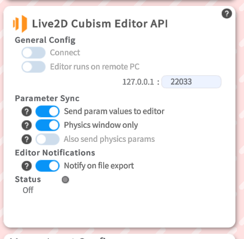
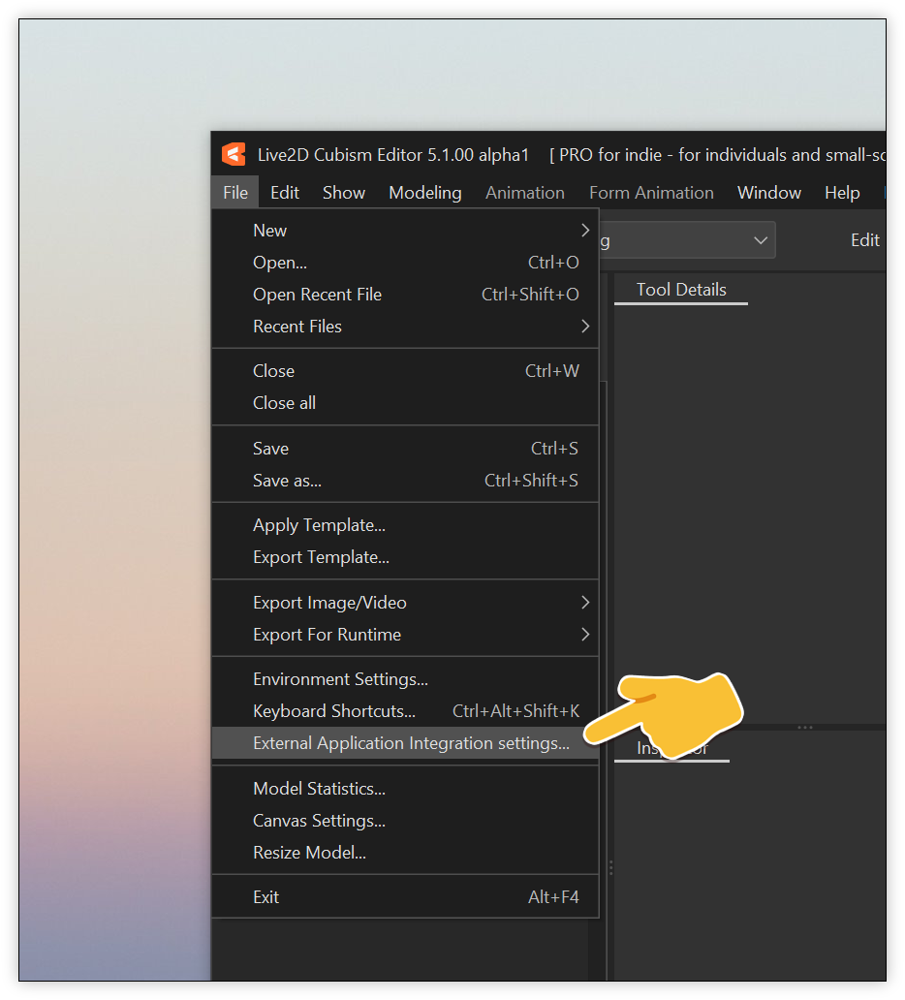
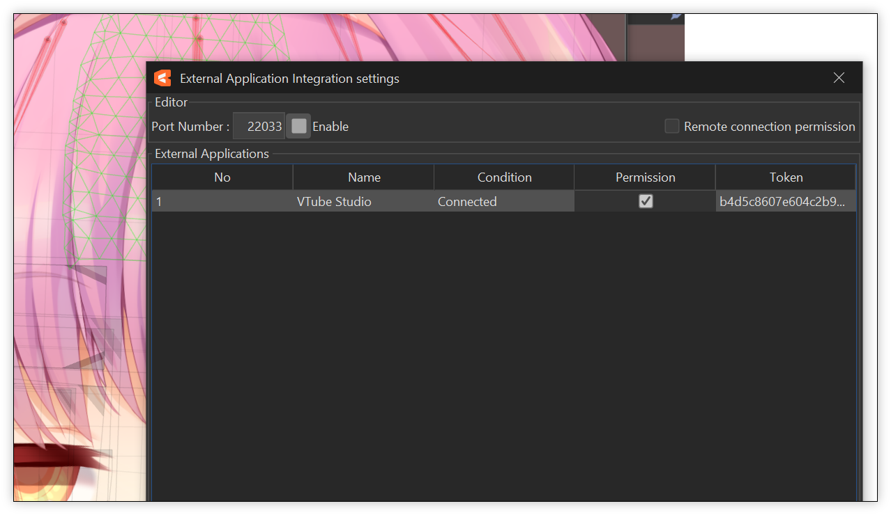
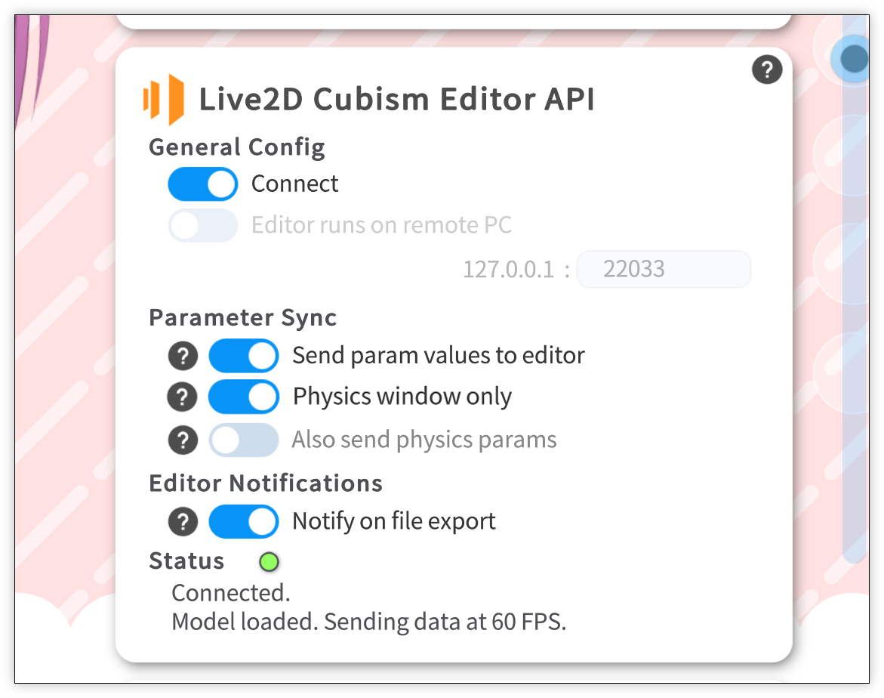
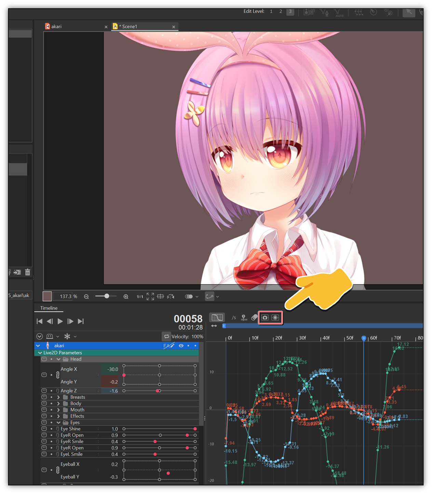

## Un résumé de ce qu'est Live2D Cubism sur VTube Studio

  

> Cette page concerne uniquement les riggers Live2D et créateurs de modèles souhaitant rapidement et facilement tester leur modèles. Si tu souhaites apprendre à utiliser VTube Studio, consulte [ce guide qui concerne l'installation de VTube Studio](/docs/logiciels-2d/vtube-studio/installation-presentation-vtube-studio)

VTube Studio peut se connecter directement au Live2D Cubism Editor grâce à la fonctionnalité **Live2D Cubism External Application**.  
Cette intégration permet deux usages principaux :
- Envoi de données de tracking vers Live2D Cubism
    - VTube Studio transmet les mouvements captés en temps réel au Cubism Editor.  
    - Cela facilite grandement la configuration des **physiques**, car on visualise immédiatement leurs réactions sans devoir exporter le modèle.  
    - Cette fonction peut également servir à **enregistrer des animations** directement dans Cubism en utilisant les données de suivi de VTube Studio.

- Détection et copie automatique des modèles exportés
    - VTube Studio détecte automatiquement l'exportation d'un modèle depuis le Cubism Editor.  
    - Lorsqu'un modèle est exporté, il est **copié automatiquement** dans le dossier des modèles de VTube Studio, simplifiant le flux de travail.

---

## 🛠️ Comment intégrer Live2D Cubism à Vtube Studio ?

> Un grand merci à guide officiel anglais de DenchiSoft, toutes les images proviendront de ce [guide anglais](https://github.com/DenchiSoft/VTubeStudio/wiki/Live2D-Cubism-Editor-Communication)

### Activer l'API dans Live2D Cubism

\
<small style={{fontSize: "10px", display:"flex", marginTop:"-16px"}}><a href="https://github.com/DenchiSoft/VTubeStudio/wiki/Plugins" target="blank">© Photo par DenchiSoft</a></small>

Sur Live2D Cubism, allez dans:
`File → External Application Integration settings... → Clique sur l'icone "▶️" pour démarrer l'API`

\
<small style={{fontSize: "10px", display:"flex", marginTop:"-16px"}}><a href="https://github.com/DenchiSoft/VTubeStudio/wiki/Plugins" target="blank">© Photo par DenchiSoft</a></small>
ℹ️ Lors de la première connexion, vous devrez cocher la case "Permission" dans Live2D Cubism

Une fois que cela c'est fait, VTube Studio essayeras automatiquement de connecter ou de se reconnecter automatiquement en arrière-plan. 

Une fois la connexion faite, VTube Studio mémorisera la connexion, **vous n'aurez donc à effectuer cette étape qu'une seule fois.**

\
<small style={{fontSize: "10px", display:"flex", marginTop:"-16px"}}><a href="https://github.com/DenchiSoft/VTubeStudio/wiki/Plugins" target="blank">© Photo par DenchiSoft</a></small>

#### Dans le cas où mon Live2D Cubism n'est pas sur le même Ordinateur ?
Si Cubism est sur un autre PC : cocher "Editor runs on remote PC" sur VTube Studio et entrer l'IP locale du pc avec Live2D Cubism.

**Pour retrouver l'IP local:**
`Menu Démarrer → Ouvre l'nvite de commande → Entre la commande "ipconfig" et tu auras l'adresse IP local.`

---

\
<small style={{fontSize: "10px", display:"flex", marginTop:"-16px"}}><a href="https://github.com/DenchiSoft/VTubeStudio/wiki/Plugins" target="blank">© Photo par DenchiSoft</a></small>

### Enregistrement d'animation avec le Live2D Editor

Vous pouvez également utiliser cette fonctionnalité pour envoyer les données de tracking vers le **Live2D Cubism Editor** lorsque la fenêtre d'animation est active. De cette manière, vous pouvez enregistrer des images individuelles ou des animations complètes en utilisant les données de tracking de **VTube Studio**.

Dans la fenêtre d'animation du Live2D Cubism Editor, il existe deux boutons.
Lorsque VTube Studio n'est pas connecté, ces boutons sont grisés et ne peuvent pas être pressés.
Quand VTube Studio est connecté, vous pouvez maintenir ces boutons pour recevoir les données de tracking.

#### Boutons disponibles
- **Bouton Snapshot :** Maintenez ce bouton pour envoyer les données de tracking actuellement envoyées vers l'image sélectionnée de l'animation. Les données sont envoyées tant que le bouton est maintenu et écraseront les valeurs de paramètres existantes.

- **Bouton Record :** Maintenez ce bouton pour enregistrer les données de tracking. Le temps dans la fenêtre d'animation avancera et les images seront enregistrées tant que le bouton reste pressé.

#### Points importants à retenir
- Vous devez toujours sélectionner le modèle auquel vous souhaitez envoyer les données dans la timeline d'animation.\
Cela fonctionne aussi si plusieurs modèles sont chargés dans la timeline, tant que l'un d'eux est sélectionné.
Évidemment, vous devez avoir le modèle correspondant chargé dans VTube Studio afin que les paramètres envoyés/reçus correspondent.
- Votre animation dans la fenêtre d'animation du Live2D Cubism Editor possède un FPS défini (par exemple, 60).
VTube Studio enverra toujours les données selon son FPS interne actuel.\
Cela signifie qu'un léger décalage peut exister entre les deux, même si vous définissez la même valeur de FPS dans les deux logiciels.
- Dans certains cas, cela peut entraîner des images manquantes, où aucune donnée n'a été reçue dans l'Editor pour l'animation.\
Ce n'est généralement pas un problème, car une interpolation sera effectuée et l'animation restera fluide.
- Cependant, cela peut causer des problèmes lors de l'enregistrement par-dessus des données d'animation existantes :\
les nouvelles données ne rempliront que les images manquantes, ce qui peut produire une animation incohérente.
Pour cette raison, il n'est pas recommandé d'enregistrer par-dessus une animation déjà existante.

ℹ️ Une fois votre animation terminée, supprimez les données existantes dans la timeline pour commencer un nouvel enregistrement.

---

## ⌨️ Raccourcis clavier (Hotkeys)

Lorsque vous travaillez sur un modèle dans Live2D Cubism, vous pouvez souhaiter activer ou désactiver à la volée l'envoi des paramètres depuis VTube Studio vers l'Editor.

Pour cela, vous pouvez configurer un raccourci (Hotkey) dans VTube Studio afin de basculer l'envoi des paramètres on/off.

**Le type de hotkey à utiliser s'appelle :**\
`Live2D Editor API param sync`

---

## ⚙️ Information concernant la performance

VTube Studio enverra toutes les valeurs de paramètres au Live2D Cubism Editor à chaque frame.\
ℹ️ Pour les modèles lourds fonctionnant à faible FPS dans l'Editor, cela peut provoquer un freeze complet du logiciel.

Pour réduire les risques de freeze ou si vous en avez, activer l'option sur VTube Studio:
**Physics window only**

## 📄 Fin du tutoriel
Tu sais enfin tout sur les plugins Vtube Studio !\
[Tu peux reprendre la suite du guide d'installation si tu le souhaites](/docs/logiciels-2d/vtube-studio/installation-presentation-vtube-studio#configuration-de-la-souris-sur-vtube-studio)

---

## 📚 Sources & Bibliographie

### Documentation officielle
- **Wiki** - *Documentation anglaise de VTube Studio par DenchiSoft*  
https://github.com/DenchiSoft/VTubeStudio/wiki

---

## 🙌 Contributeurs
**Rédaction:** 
- [TakuDev](https://www.twitch.tv/takudev)
