### Version vidéo
**(non-officiel à FRVDocs, vidéo de la communauté)**

  

    <iframe
      src="https://www.youtube.com/embed/TlhTeDrRKuM"
      title="Commandes sur twitch"
      allow="accelerometer; autoplay; clipboard-write; encrypted-media; gyroscope; picture-in-picture"
      allowfullscreen
      style={{
        border: 0,
        position: 'absolute',
        top: 0,
        left: 0,
        width: '100%',
        height: '100%',
      }}>
    </iframe>
  

## 📦 1. Installer VTube Studio

1. Ouvre **Steam**.
2. Recherche **"VTube Studio"**.
3. Clique sur **Installer**.

- L'application est **gratuite**, mais affiche un **watermark** (logo) sur ton modèle.
- Pour supprimer le watermark, tu peux acheter le **DLC "Remove Watermark"**.
- Il existe aussi un **DLC collab** pour afficher plusieurs modèles (collabs VTuber).

> 💰 En gros, si tu prends **tous les DLC VTube Studio desktop**, compte environ **32 €**.

### 1.1. 💶 Combien me coûte les addons payant officiel et non officiel de VTube Studio ?

⚠️ **DISCLAIMER**: Tu n'as pas besoin de tout pour commencer. Au minimum:

- **PC + VTube Studio (gratuit)**  
- **Webcam** *ou* **smartphone** pour le tracking\
ℹ️ À l'exception si tu track que la bouche, au quel cas tu peux activer le mode "Audio-only"

#### Les DLCs de Vtube Studio
- **VTube Studio – DLC watermark + collab** : ~31.99 €
- **VTube Studio Mobile Pro** : ~14 €

#### Pour des trackings avancés:
- **VBridger** : ~8.19 € (+18.79 € si tu veux l'éditeur avancé, pas nécessaire pour un setup basique)
- **Vitamins** : gratuit, mais support limité

---

## 💿 2. Lancer VTube Studio pour la première fois

Tu peux lancer l'application de deux façons :

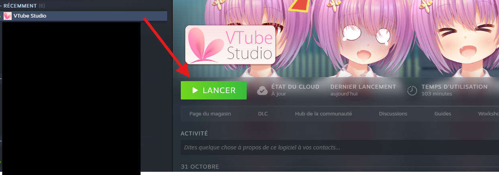  
1. **Depuis Steam** (classique)

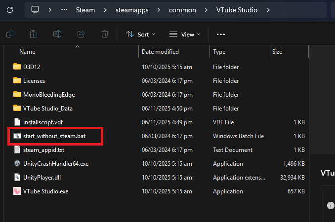  
2. Ou en lançant directement l'exécutable dans le **dossier du jeu** (souvent un peu plus léger en ressources, utile pour les PC modestes).

ℹ️ L'application devrais se trouver vers
`C:\Program Files (x86)\Steam\steamapps\common\VTube Studio`

---
## 👀 3. Présentation de l'interface

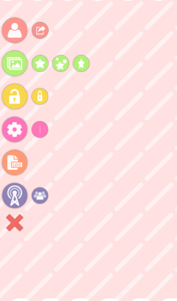  

Une fois ouvert :
- **Double-clique** dans la fenêtre principale pour afficher le **menu principal**.

Icônes importantes (de gauche à droite) :

- 👤 **Icône personnage** : Permet de changer de modèle VTS
- 🖼️ **Backgrounds** : Permet de changer le background
- 🔓 **Icône locket ouvert** : Vérouiller le déplacement de l'avatar
- ⚙️ **Settings** : Paramètres Vtube Studio
- 📝 **Logs** : Permet l'affichage des logs Vtube Studio pour débuggage (attention, peux contenir des informations sensibles)
- 🛜 **Icône Vnet** : Permet d'accéder au module VNet (le DLC est nécessaire)

---

## 📂 4. Explication de ton modèle & des fichiers Live2D

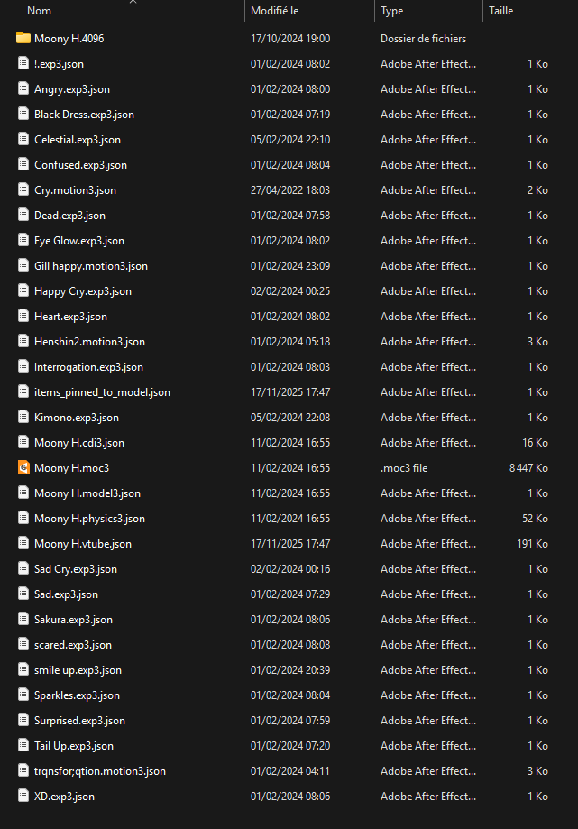  

Dans la plupart des cas, tu reçois un **.zip** contenant un **dossier modèle**.  

Tu dois avoir au minimum :
- Fichier runtime Live2D (souvent `.moc3` ou équivalent)
- Fichier **model JSON** (`.json`)
- Fichier de **physique** (`.physics3.json` ou similaire)
- Fichier **cdi3** (optionnel mais fréquent)
- Dossier **Textures** (images du modèle)

Optionnels mais à savoir :
- **Icone de modèle** : image `512x512` en `.png` ou `.jpg` (s'affiche dans la liste des modèles)
- Fichiers d'**expressions** / **animations** (peuvent être dans le dossier principal ou dans un sous-dossier)

> ⚠️ Si un fichier essentiel manque, le modèle **ne se chargera pas** dans VTube Studio.

---

## 🧍 5. Importer ton modèle dans VTube Studio

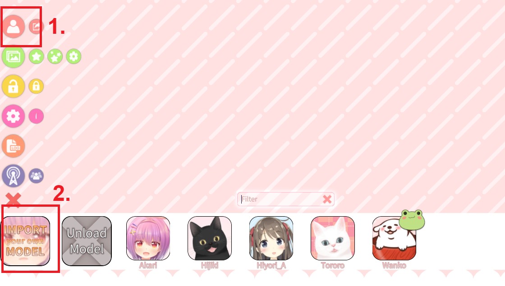  

1. Clique sur l'icône 👤 **Icône personnage** pour ouvrir la bar des personnages en bas
2. Clique sur "Import your own model"
3. Une pop-up va s'afficher, clique sur "open folder"
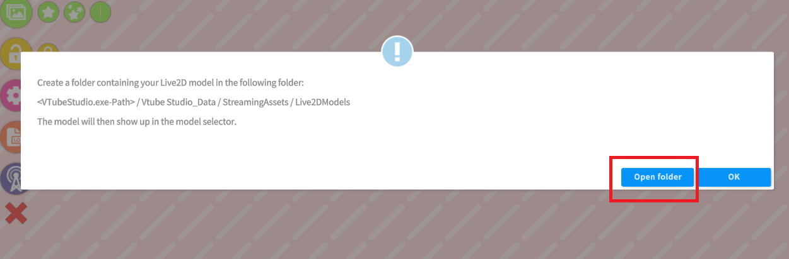  

4. Cela t'enmène sur le dossier de Vtube Studio pour importer les modèles Live2D:  
`<VTubeStudio.exe-Chemin>/VTube Studio_Data/StreamingAssets/Live2DModels`

5. **Glisse-dépose** le **dossier entier** de ton modèle dans `Live2DModels`\
⚠️ Ne copie pas seulement les fichiers internes : garde la structure entière.

6. **Reclique sur la sélection des avatars sur Vtube studio**, Tu devrais voir ton modèle dans la liste.\
🕒 S'il n'apparaît pas immédiatement, ferme et rouvre le menu une ou deux fois : la liste se rafraîchit.

### 5.1. Un pop-up sur l'auto-setup est apparu, je dois faire quoi ?

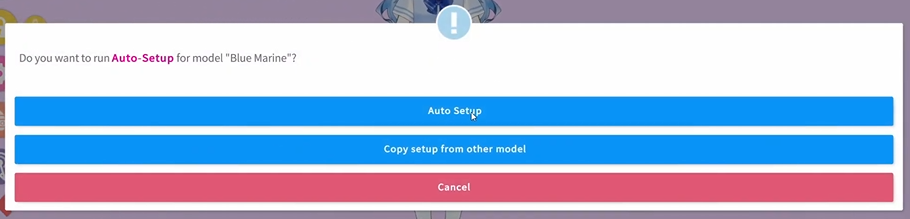  

Si c'est une **nouvelle exportation** de modèle, VTube Studio peut afficher une fenêtre :\
`Do you want to run **Auto Setup** for model "your model"`

Clique sur **Auto Setup** si :
- Le rig utilise des **paramètres standard** (headX, headY, mouthOpen, etc.)
- Tu veux que VTS configure automatiquement les liens **tracking → paramètres du modèle**

ℹ️ À titre informatif, tu peux relancer un auto-setup plus tard depuis la **fenêtre paramètres** du modèle ou copier la configuration d'un **ancien modèle** vers ton nouveau modèle (pour copier ces expressions, animations, etc.).

**Si tu ne vois pas cette fenêtre, c'est probablement que :**
- Tu utilises un **pré-made** déjà configuré par le rigger, dans ce cas là tout est bon !
- Ou ton modèle a déjà une config VTS existante

---

## 📷 6. Configurer la caméra

> Si ton modèle n'utilise **pas** de face tracking (juste mouvement avec la voix ou la bouche), tu peux sauter cette section [et passer à la suivante](installation-presentation-vtube-studio#%EF%B8%8F-8-les-autres-param%C3%A8tres-importants).

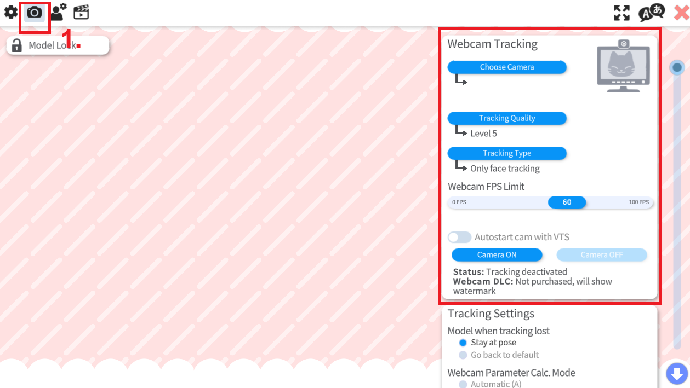

À la page d'accueil, clique sur l'icone **Settings**, puis sur l'icône de caméra pour arriver sur les paramètres du tracking.

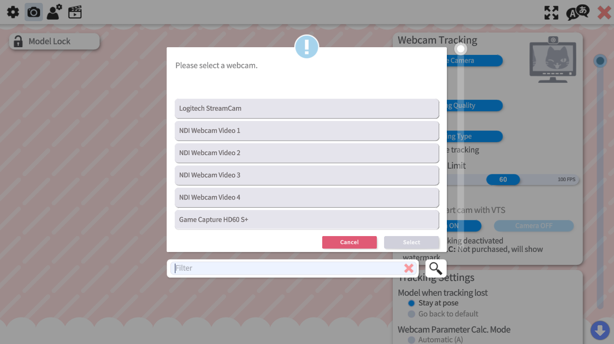  

Clique sur "Choose Camera" et tu peux ensuite choisir la caméra que tu souhaites mettre en place.

ℹ️ Tu peux passer le choix de la caméra si tu souhaite utiliser le tracking depuis ton iphone ou android.

  

Tu peux choisir plusieurs niveau de tracking
- **Les trackings vont de niveau 1 à 5**\
Du moins précis au plus précis et du moins gourmand au plus gourmand pour ton CPU/processeur.\
ℹ️ Seulement le **Tracking de Niveau 5 et le Niveau 4 de façon limité** permet de détecter les clins d'oeils.

- **NVIDIA Broadcast Tracker et NVIDIA Broadcast Tracker** \
Ils utilisent la technologie des cartes graphiques **RTX** afin de pouvoir tracker le visage avec un autre système. C'est souvent jugé plus précis.\
⚠️ La consommation de cette technologie dépend de la puissance de la carte graphique.

- **Mediapipe Webcam Tracker**\
Technologie de tracking proposé par Google. Il est souvent considéré comme aussi bon que le tracking de NVIDIA sauf qu'elle ne dépends d'aucune carte graphique RTX pour y être utilisé.

ℹ️ À noter qu'il te faut le DLC **NVIDIA tracking** ainsi que **NVIDIA Broadcast** si ça ne marche pas (les deux sont gratuits), pour avoir accès aux niveau de tracking fait par NVIDIA.

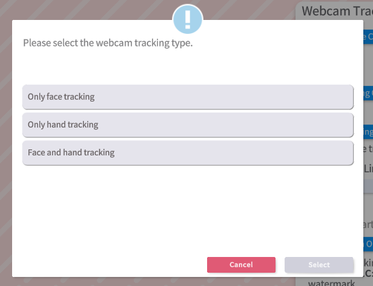  

Ces paramètres permettent de régler un tracking partiel, ce qui peux être parfait si tu souhaites que l'Iphone/Android fasse le tracking précis du visage et que le reste (mouvement de la tête ou du corps) sois gérée par la caméra.

- **Only face tracking**: Uniquement le tracking du visage
- **Only hand tracking**: Uniquement le tracking des mains
- **Face and hand tracking**: permet le tracking des mains et du visage. **(Option par défaut)**

---

## 🛠️ 7. Les autres paramètres importants

  

Dans le menu **Settings**, tu verras 3 autres sections :

### ⚙️ General Settings

#### Configuration générale

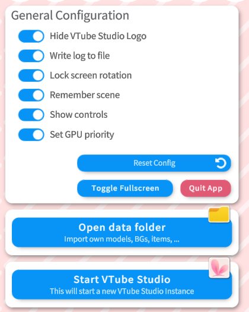 

Dans l'ordre:
- Cacher le logo de VTube Studio
- Écrire le débuggage/journal dans un fichier
- Verrouiller la roation de l'écran
- Enregistrer la scène dans l'état
- Afficher les contrôles
- Définir l'application en priorité CPU\
(⚠️ Pour s'assurer du bon fonctionnement de l'application, il vaut mieux le laisser prioritaire)

Les options de base de l'application, Elles sont tous cochés par défaut et tu n'as rien à modifier.

#### Paramètre de connexion (WiFi)

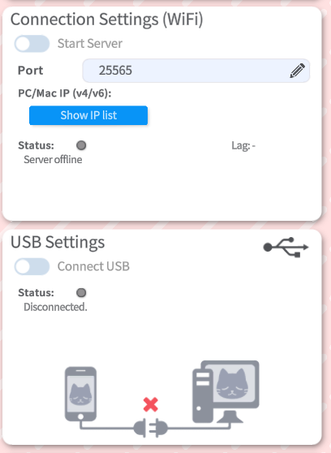

####  Paramètres USB (Ne marche qu'avec Iphone)

Ce module te permet de connecter ton téléphone à VTube Studio pour s'en servir comme moyen de tracking.

**Prérequis:**
- Tu dois avoir potentiellement les services Apple (Je l'ai pas installé mais ça peux être nécessaire si tu reçois un message d'erreur "NoDevice - AppleMobileDeviceService may not be running").\
[Installer ITunes ici](https://www.microsoft.com/en-gb/p/itunes/9pb2mz1zmb1s?cid=appledotcom-store&rtc=1&activetab=pivot:overviewtab)

Lorsque tu connectes ton appareil via USB, assures-toi que le "Partage de connexion" n'est pas activé sur ton iPhone/iPad.
S'il est activé, il est possible que le PC/Mac utilise tes données mobiles via l'USB pour accéder à Internet. 
Cela peut entraîner une consommation de tes données mobiles, donc assurez-toi que le "Partage de connexion" est désactivé.

#### Plugins VTube Studio

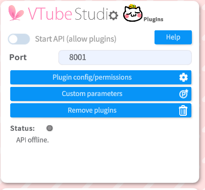  

VTube Studio possède un système de plugins grâce à l'API VTube Studio.\
**⚠️ DISCLAIMER : La gestion des plugins n'est pas supporté sur smartphone (Android/Apple).**

**Quelques exemple de ce qui est réalisable :**
- Activer des commandes (par exemple via des dons Twitch, des superchats YouTube ...)
- Contrôler les paramètres du suivi facial et contrôler le modèle.
- Injecter des données ou des paramètres, permettant littéralement à n'importe quoi de contrôler votre modèle (ça peux être des logiciels, des manettes de jeu ou n'importe quoi présent sur VTube Studio.)
- Faire une transformation: Déplacer, agrandir/rétrécir ou faire pivoter le modèle.

ℹ️ Les plugins ne peuvent pas accéder à votre webcam ni lire de données personnelles via VTS.

Si tu veux plus de détail sur les plugins sur VTube Studio, [tu peux suivre ce guide](/docs/plugin-vtube-studio)

#### Module API de l'éditeur Cubism Live 2D (pratique pour les créateurs Live2D)

  

> Ce module est uniquement utilisé pour tous les Rigger live2D, si tu souhaites juste utiliser VTube studio, [tu peux passer à la section suivante](#configuration-de-la-souris-sur-vtube-studio)

VTube Studio peut se connecter directement au Live2D Cubism Editor grâce à la fonctionnalité **Live2D Cubism External Application**.  
Cette intégration permet deux usages principaux :
- Envoi de données de tracking vers Live2D Cubism
    - VTube Studio transmet les mouvements captés en temps réel au Cubism Editor.  
    - Cela facilite grandement la configuration des **physiques**, car on visualise immédiatement leurs réactions sans devoir exporter le modèle.  
    - Cette fonction peut également servir à **enregistrer des animations** directement dans Cubism en utilisant les données de suivi de VTube Studio.

- Détection et copie automatique des modèles exportés
    - VTube Studio détecte automatiquement l’exportation d’un modèle depuis le Cubism Editor.  
    - Lorsqu’un modèle est exporté, il est **copié automatiquement** dans le dossier des modèles de VTube Studio, simplifiant le flux de travail.

Si tu veux plus de détail sur les plugins sur VTube Studio, [tu peux suivre ce guide](/docs/plugin-vtube-studio)

#### Configuration de la souris sur VTube Studio

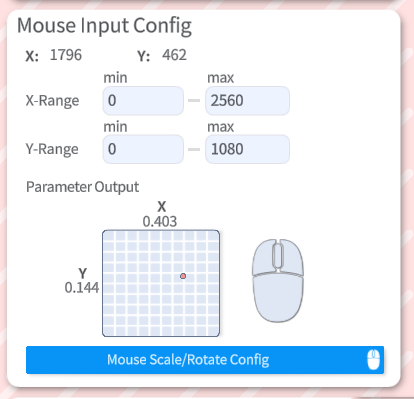  

#### Paramètre du microphone & Gestion avancée du LipSync

  

#### Intégration Twitch (déclencher des hotkeys via des Redeems)

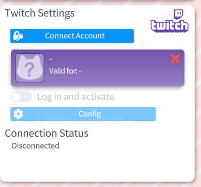

Ce module permet d'intégrer des interactions entre ton modèle et des points de chaine sur Twitch

1. Clique sur **🔑 Connect Account** et autorise VTube Studio.
2. Une fois connecté, clique sur "Log in and activate".\
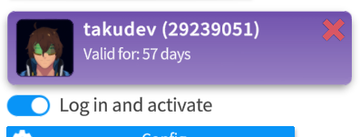\
ℹ️ Quand tu es connecté, cela génère un token temporaire qui reste valide pendant 57 jours. Il faudra donc se reconnecter après le 57ème jour pour réassocier VTube Studio à Twitch.

3. Clique sur le bouton **Config** qui te permet d'avoir accès à la liste des fonctionnalités que tu peux faire et configurer avec VTube Studio\
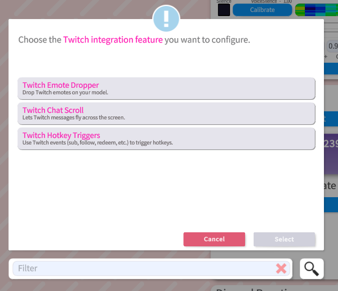\
➡️ Hésite pas à regarder les différentes fonctionnalités qui ont pleins d'options intéressantes.
Dès que tu seras en live, les viewers pourront déclencher ces features via Twitch.

--- 
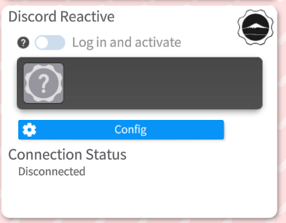  
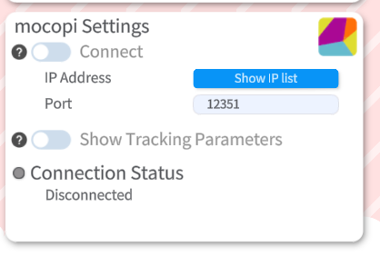  

### 👤 Model Configuration

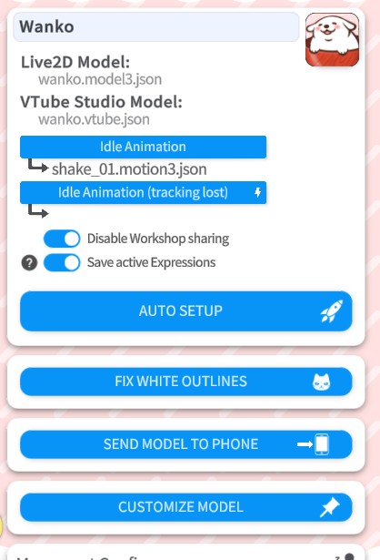  
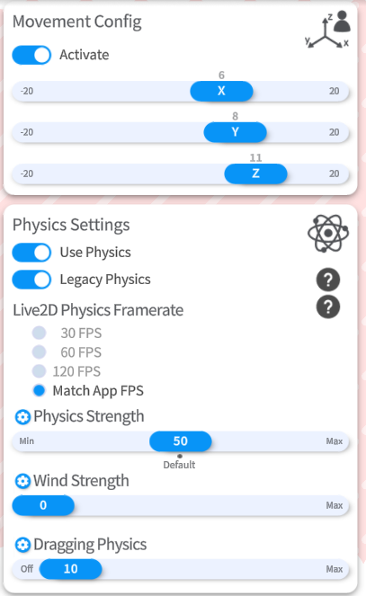  
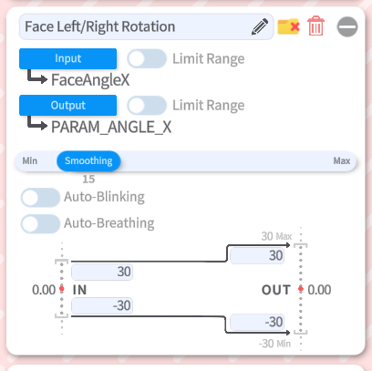  

### 🎬 Le paramètres des raccourcis clavier (Hotkeys)

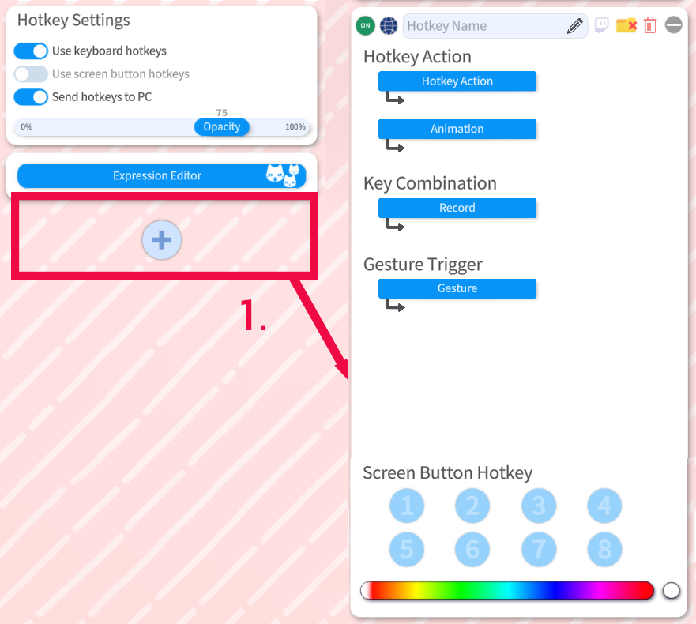  

---

## 📚 Sources & Bibliographie

### Documentation officielle
- **Wiki** - *Documentation anglaise de VTube Studio par DenchiSoft*  
https://github.com/DenchiSoft/VTubeStudio/wiki

---

## 🙌 Contributeurs
**Rédaction:** 
- [TakuDev](https://www.twitch.tv/takudev)
