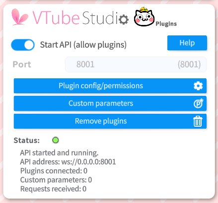
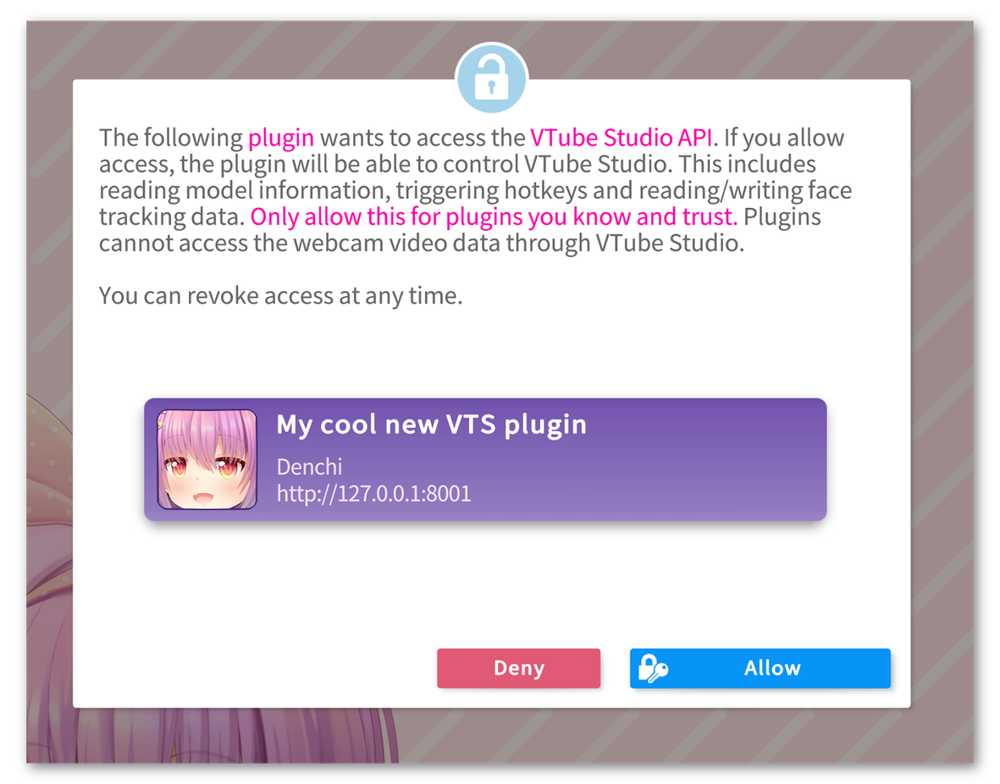

> Le Wiki VTube Studio contient les informations les plus récente et en détail. n'hésite pas à [le consulter ici](https://github.com/DenchiSoft/VTubeStudio/wiki/Plugins)\
(⚠️ Documentation uniquement anglaise).

### Version vidéo
**(non-officiel à FRVDocs, exemple de vidéo qui concerne les plugins en anglais)**

  

    <iframe
      src="https://www.youtube.com/embed/IiZ0JrGd6BQ"
      title="Commandes sur twitch"
      allow="accelerometer; autoplay; clipboard-write; encrypted-media; gyroscope; picture-in-picture"
      allowfullscreen
      style={{
        border: 0,
        position: 'absolute',
        top: 0,
        left: 0,
        width: '100%',
        height: '100%',
      }}>
    </iframe>
  

## Un résumé de ce qu'est des plugins sur VTube Studio

VTube Studio possède un système de plugins grâce à l'API VTube Studio.\
**⚠️ DISCLAIMER : La gestion des plugins n'est pas supporté sur smartphone (Android/Apple).**

**Quelques exemple de ce qui est réalisable :**
- Activer des commandes (par exemple via des dons Twitch, des superchats YouTube ...)
- Contrôler les paramètres du suivi facial et contrôler le modèle.
- Injecter des données ou des paramètres, permettant littéralement à n'importe quoi de contrôler votre modèle (ça peux être des logiciels, des manettes de jeu ou n'importe quoi présent sur VTube Studio.)
- Faire une transformation: Déplacer, agrandir/rétrécir ou faire pivoter le modèle.

ℹ️ Les plugins ne peuvent pas accéder à ta webcam ni lire de données personnelles via l'**API VTS**.

## Liste des plugins connues sur VTube Studio

Ces plugins sont **non officiels** et non développés par l'auteur du logiciel DenchiSoft, n'utilises que des plugins provenant de sources sûres.

- [**VTS P.O.G** - *Eruben*](https://eruben.itch.io/vts-pog/)  
  Ajoute des messages TTS déclenchés par chat/bits/subs et permet au modèle live2D de les lire.

- [**Audiomimi** - *Artemiz & Mokunine*](https://ko-fi.com/s/25d2b6bafa)  
  Utilise des effets sonores basés sur le mouvement des paramètres.

- [**ViewLink** - *Kawa Entertainment*](https://kawaentertainment.itch.io/viewlink)  
  Permet d'utiliser un modèle Live2D réagissant au gameplay VR sans matériel supplémentaire.

- [**Fugi Tech, discord reactive** - *Fugi & Iron Vertex*](https://vts-react.fugi.tech/)  
  Intégration Twitch/YouTube simple à configurer via une interface web.

- [**VTS Desktop Audio** - *Lua Lucky*](https://lualucky.itch.io/vts-desktop-audio-plugin)  
  Utilise l'audio du PC comme paramètres dans VTS.

- [**VBridger** - *PiPuProductions & Serp*](https://store.steampowered.com/app/1898830/VBridger)  
  Plugin de tracking avancé optimisant l'utilisation des données ARKit sur iPhone.

- [**Mix It Up Bot**](https://mixitupapp.com/)  
  Bot de streaming polyvalent intégrant l'activation de hotkeys VTS.

- [**VTChaos** - *Raelice*](https://github.com/Raelice/VTchaos)  
  Chatbot YouTube/Twitch envoyant des commandes VTS via le chat.

- [**Stream Deck Plugin** - *Cazzar*](https://marketplace.elgato.com/product/vtube-studio-0ba9f87f-d5ec-44ca-98ac-6b95e6e477d3)  
  Contrôle complet de VTS via le Stream Deck (store officiel).

- [**TP_VTS (Touch Portal)** - *Wiccy*](https://wiccy.itch.io/tp-vts)  
  Contrôle de VTS via l'application Touch Portal.  
  Supporte hotkeys, mouvements, couleurs, etc.

- [**VtubeStudioSimpleSETool** - *物部モノ子*](https://mononobe-monoko.booth.pm/items/3468381)  
  Joue automatiquement des effets sonores selon les valeurs de tracking.

- [**Twitch Integrated Throwing System** - *Remasuri32*](https://remasuri3.itch.io/tits)  
  Permet aux viewers de lancer des objets sur votre modèle.

- [**VTS-Puppet** - *Eruben*](https://eruben.itch.io/vtspuppet)  
  Contrôle du modèle via manette (Xbox, Switch Pro…).

- [**VTSLivePlugins** - *最速のゆっくり*](https://github.com/fastestyukkuri/VTSLivePlugins)  
  Contrôle du modèle selon l'heure, la météo, le cycle solaire, etc.

- [**VTS Heartrate** - *Skeletom*](https://skeletom-ch.itch.io/vts-heartrate)  
  Connecte votre fréquence cardiaque à votre avatar.

- [**Karasubonk (KBonk)** - *typeou*](https://typeou.itch.io/karasubonk)  
  Plugin léger pour lancer des objets sur le modèle via Twitch.

- [**VTS Chameleon** - *Shotaro Akiyama*](https://satetsu888.github.io/vts-chameleon/)    
  Plugin de recoloration dynamique du modèle.

- [**Nyarupad VTS** - *Maruseu*](https://maruseu.itch.io/nyarupad-vts)  
  Ajoute des paramètres pour contrôler le modèle via une manette.

- [**VTS Image Gacha** - *No_Name_Paladin*](https://no-name-paladin.itch.io/vtube-studio-image-gacha)  
  Permet au chat Twitch d'épingler aléatoirement des images sur le modèle.

---

## 🧩 Comment utiliser un plugin ?

### Activer l'API VTS

Dans les paramètres, activez l'**API VTS**.  
Elle démarre par défaut sur le **port 8001** (ou 8002/8003 si déjà utilisé).  
ℹ️ Vous pouvez changer le port manuellement avant le démarrage de l'API au besoin.

  

### Demande de permission du plugin

Une fois l'**API VTS** lancée, les plugins utilisant VTube Studio vont demander une **autorisation** par l'intermédiaire d'une pop-up.  
Si tu acceptes, le plugin sera ajouté à la liste des plugins autorisés et **Actifs**.

\
<small style={{fontSize: "10px", display:"flex", marginTop:"-16px"}}><a href="https://github.com/DenchiSoft/VTubeStudio/wiki/Plugins" target="blank">© Photo par DenchiSoft</a></small>

### Et si je veux supprimer les permissions ou remettre par défaut ?

Les permissions sont stockées dans le dossier :\
`Config/Plugins`

Supprimer ce dossier révoque toutes les autorisations.

---

## 🧑‍💻 Développer un plugin VTube Studio

N'importe qui peut développer un plugin, gratuit ou payant, la [licence](https://denchisoft.com/license/) l'autorise.  
Aucune licence ou redevance n'est demandée par DenchiSoft.

**Lien vers la documentation pour le développement:** \
https://github.com/DenchiSoft/VTubeStudio/

**Le discord de DenchiSoft si tu as des questions technique lié au développement de ton plugin:** \
https://discord.gg/VTubeStudio

**⭐ Partages tes créations sur Twitter auprès de @VTubeStudio !**  
Si ton plugin est utile, bien documenté et facile à installer, il pourra être mis en avant.

---

## 📄 Fin du tutoriel
Tu sais enfin tout sur les plugins Vtube Studio !\
[Tu peux reprendre la suite du guide d'installation si tu le souhaites](/docs/logiciels-2d/vtube-studio/installation-presentation-vtube-studio#module-api-de-léditeur-cubism-live-2d-pratique-pour-les-créateurs-live2d)

---

## 📚 Sources & Bibliographie

### Documentation officielle

- **Wiki** - *Documentation anglaise de VTube Studio par DenchiSoft*  
https://github.com/DenchiSoft/VTubeStudio/wiki

---

## 🙌 Contributeurs
**Rédaction:** 
- [TakuDev](https://www.twitch.tv/takudev)