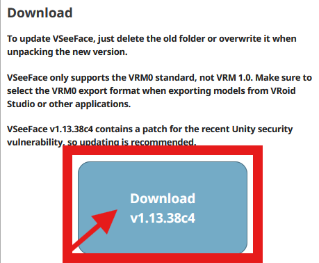
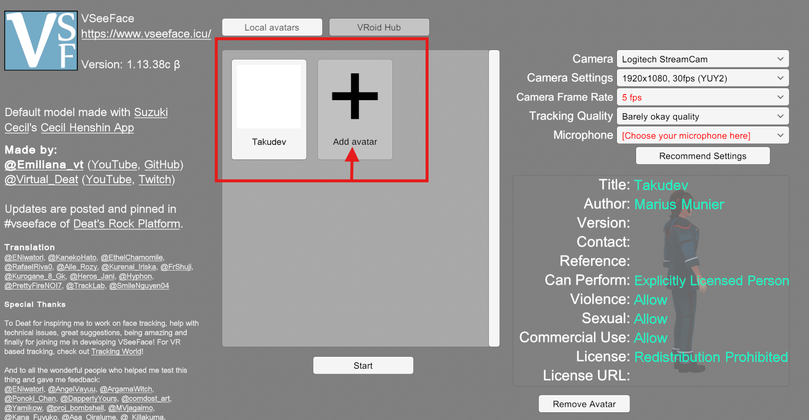
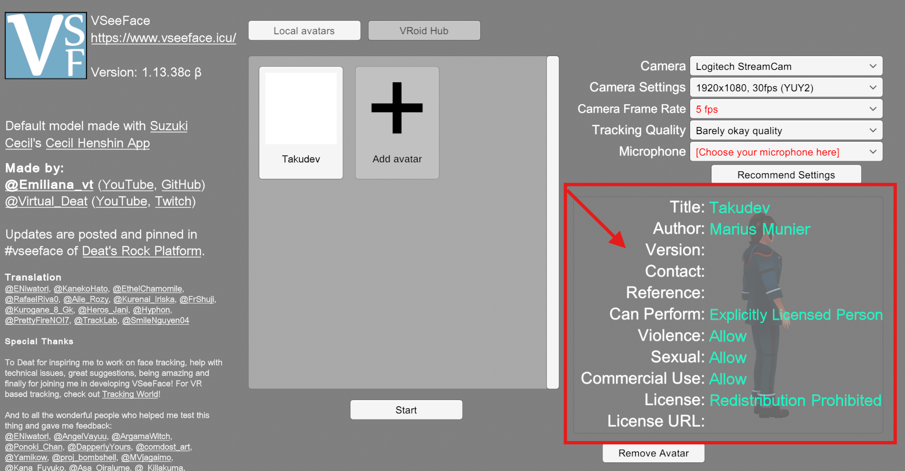
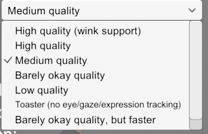
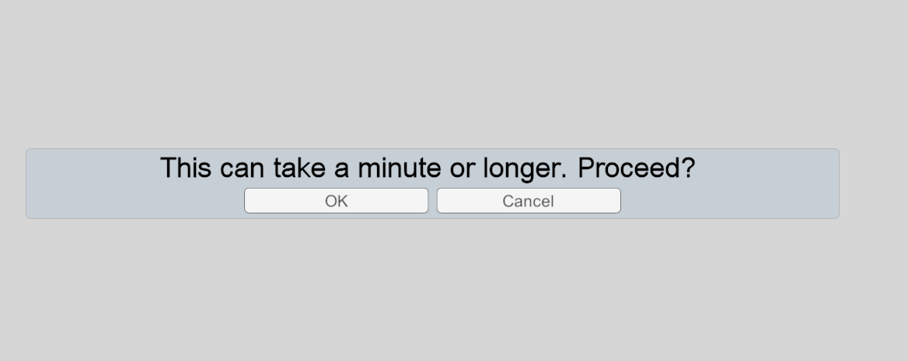
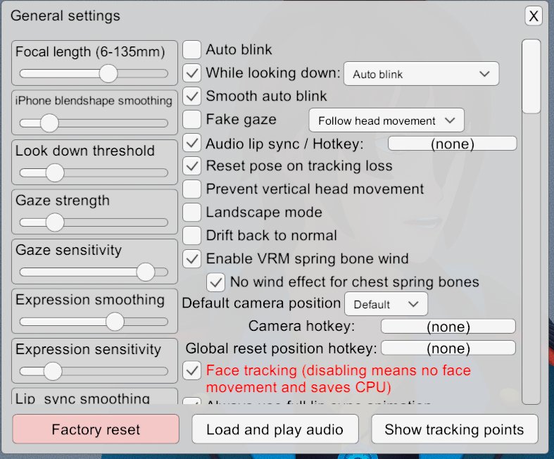
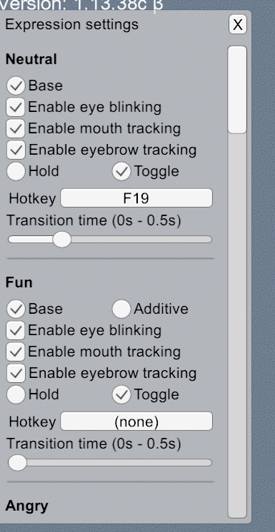
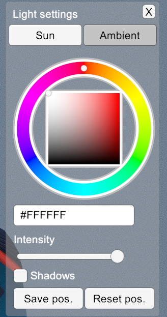
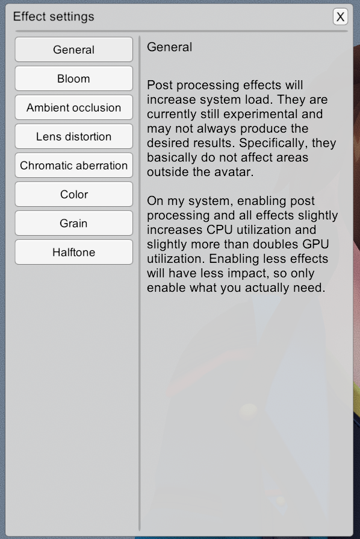
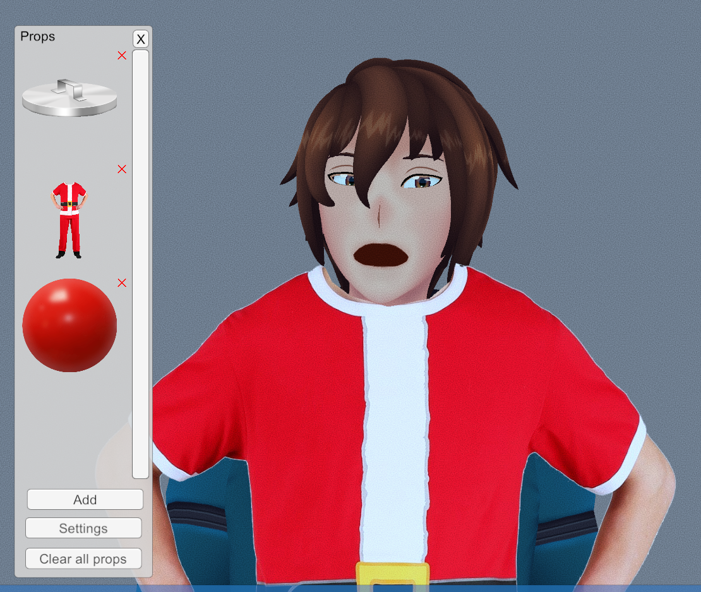

### Version vidéo
**(non-officiel à FRVDocs, vidéo de la communauté)**

  

    <iframe
      src="https://www.youtube.com/embed/pz6UYktxuhs"
      title="Commandes sur twitch"
      allow="accelerometer; autoplay; clipboard-write; encrypted-media; gyroscope; picture-in-picture"
      allowfullscreen
      style={{
        border: 0,
        position: 'absolute',
        top: 0,
        left: 0,
        width: '100%',
        height: '100%',
      }}>
    </iframe>
  

## 🧰 1. Télécharger VSeeFace

1.  Ouvre ton navigateur (Google, Firefox, ce que tu veux).
2.  Tape **VSeeFace** dans Google.
3.  Va sur le site : [Vseeface.icu](https://www.Vseeface.icu).
4.  Dans le menu à gauche, clique sur **Download**.
5.  Télécharge la *dernière version* de VSeeFace.

### 🐧 1.1 Concernant le support Linux

Suivez-ce guide spécialement dédiée pour l'installation sous Linux avant de revenir dans ce guide:\
[Guide pour l'installation sous Linux](/docs/installation-linux-vseeface)

------------------------------------------------------------------------

## 📦 2. Installation & Décompression

1.  Va dans ton dossier **Téléchargements**.
2.  Fais un **clic droit** sur le fichier compressé.
3.  Clique sur **Extraire vers VSeeFace/**.
4.  Quand l'extraction est finie, tu peux placer le dossier où tu veux. Fais glisser le dossier sur ton **Bureau** par exemple.

------------------------------------------------------------------------

## 🧙 3. Ajouter ton Avatar VRM

1.  Lance **VSeeFace**.
2.  Sur la page d'accueil, clique sur **Add Avatar**.
3.  Choisis ton fichier **.vrm**.
4.  Clique sur **Open**.

Ton avatar est maintenant chargé dans VSeeFace !

Les informations sur ce que tu peux faire avec ton avatar ou non sont sur la droite, on appelle ça **les métadonnées** de ton avatar.

ℹ️ À noter que au dessus de la liste de tes avatars, tu peux aussi connecter ton compte VRoid Hub pour récupérer les VRoid/VRM depuis le site.

------------------------------------------------------------------------

## 📷 4. Configurer la caméra & micro

Dans l'interface :

-   **Camera** → choisis ta webcam.
-   **Résolution** → prends la résolution max que ta cam supporte.
-   **Framerate** → Choisis de préférence *60 fps* ou *30 fps* au minimum pour que ça reste fluide.  
ℹ️ *15 fps* est acceptable si tu as une petite configuration mais tu risques d'avoir des sacades.
-   **Tracking Method** → par défaut tu peux prendre "medium quality" ou "high quality" si tu veux le tracking le plus précis.  

*C'est quoi les différences ?*

-   **Microphone** → sélectionne ton micro.

Ensuite clique sur **Start**.

Ton avatar bouge ? Parfait. Sinon, check ta cam/micro.

### ✨ 4.1. Les différentes qualités de tracking en détail

**🔥 High Quality (recommandé)**
- C'est le mode par défaut.
- Le tracking est au top, super précis.
- Par contre, ça utilise pas mal de CPU.

➡️ À utiliser si ton PC tient bien la route.

**⚖️ Medium Quality**
- Légèrement plus rapide.
- Tracking un peu moins précis, mais ça reste solide.
- Un bon compromis si ton PC chauffe un peu trop en High ou sur les jeux gourmands.

➡️ Tu peux utiliser cet qualité pour alléger le PC si les jeux sont trop gourmand malgrès une grosse configuration PC

**🙂 Barely Okay Quality**
- Là, on gagne vraiment en rapidité.
MAIS le tracking devient clairement moins bon :
- clignements moins fiables,
- sourcils moins précis,
- expressions détectées beaucoup moins bien.

ℹ️ Il est recommandé d'activer l'auto-blink ici (et en Low).

**🟡 Low Quality**
- Un peu plus rapide que Medium.
- Tracking visiblement moins bon.
- Si tu veux tourner sur un gros jeu en même temps, ça peut aider.

ℹ️ Il est recommandé d'activer l'auto-blink ici (et en Low).

**🍞 Toaster (oui oui)**
- Mode spécial pour les vieux PC (les vraies machines à pain).
- Ultra rapide.
Par contre, grosse contrepartie :
- pas de clignement d'yeux,
- pas de regard,
- pas de détection d'expressions.
- ne fais vraiment pas griller ton pain (désolé)

➡️ À utiliser uniquement si ton PC n'arrive pas à suivre les autres modes.

### ✨ 4.2. Tu ne sais pas quel qualité choisir sans que ton PC explose ?

Pas de panique, VSeeFace as tout prévu et te propose de faire un test directement sur ton ordinateur !
Tu peux directement cliquer sur "Recommend Settings". L'opération prendra 1 minute ou plus et tu pourras
avoir directement la configuration de mise sur ton PC

Une fois les résultats reçu, tu pourra savoir exactement le nombre d'FPS de chaque tracking, ce qui est parfait si tu veux tester un cas de figure où tu utilise ton modèle à côté d'un jeu-vidéo que tu joues souvent, pour être sûr que ton application ne laggera pas en live.

------------------------------------------------------------------------

## 🛠️ 5. Les paramètres importants

Clique sur **Settings** puis :

### 🔧 General Settings

- **Focal Length**\
Ajuste la profondeur et l'effet de perspective.\
Pour un style plus 2D et donc avoir moins de perspective, utiliser une focale plus proche de 135mm.

- **Blink Sensitivity**\
Détermine la sensibilité du tracking des clignements.\
Cela dépends de la caméra mais une sensibilité plus élevée que la moyenne peux aider à ce qu'il y ai plus de répondant.

- **Blink Smoothness**\
Lissage du clignement.\
Position recommandée : Tu peux le laisser au milieu.

- **Gaze Strength**\
Intensité du mouvement des yeux.\
Peut être ajusté selon la préférence pour un regard plus ou moins mobile.\
Position recommandée: Tu peux le laisser au milieu et si tu as un éléments qui perturbe le tracking sur tes sourcils, tu peux essayer de l'augmenter.

- **Eyebrow Strength**\
Intensité du mouvement des sourcils.

- **Eyebrow Sensitivity**\
Rend les sourcils plus réactifs.

- **Lip Sync Smoothing**\
Lissage du mouvement de la bouche.\
Recommandé : très faible pour un mouvement moins "animé".\
Si vous préférez un rendu fluide : laissez-le au maximum.

- **Mouth Sensitivity & Mouth Smoothing**\
Permettent d'ajuster le niveau et la fluidité du mouvement de la bouche.\
En général, rester sur des valeurs basses pour un rendu expressif.

### 😃 Expression Settings

#### En résumé, tu peux : 
- Activer/Désactiver des expressions. 
- Définir des transitions. 
- Ajouter des **raccourcis clavier** pour déclencher des expressions.

#### Dans le détail:
**Modes d'expression**
- Base : remplace toutes les autres expressions.
- Additive : se combine avec les expressions déjà actives.

**Options d'activation**
- Activer/désactiver : bouche, clignement des yeux, sourcils.
➡️ Utile si vous voulez qu'une expression n'agisse que sur une partie du visage.

**Mode de déclenchement**
- Hold : garder le raccourci enfoncé pour maintenir l'expression.
- Toggle : un appui active, un second appui désactive.

**Temps de transition**
- Si tu met 0 = changement instantané.
- Valeur plus haute = transition plus douce entre deux états.

### 💡 Lighting Settings

Tu peux changer : 
- La lumière provenant d'une direction particulière ou lumière directe (qu'on appelle **Sun**)
- La lumière qui est reflétée dans l'environnement ou lumière indirecte (qu'on appelle **Ambient**)
- La couleur de ta lumière. 
- L'intensité de la lumière
- La coche "Shadows" permet d'afficher ou non les ombres portées produites par le **Sun**

C'est un endroit parfait pour matcher ton design ou ton ambiance stream.  
Pour que cela sois le plus simple, tu peux laisser par défaut.

### 🌈 Effects Settings

**⚠️ DISCLAIMER**: Les effets présenté ci-dessous augmenteront la charge du système / ça consommera plus. 
Ils sont considéré comme expérimentaux par VSeeFace et peuvent ne pas toujours produire les résultats attendus. 
Plus précisément, ils n'affectent pas les zones situées en dehors de l'avatar.

Activer le post-traitement et tous les effets augmente légèrement l'utilisation du CPU et peuvent doubler l'utilisation du GPU. 
Activer moins d'effets aura un impact moindre, donc n'**activez que ce dont vous avez réellement besoin**.

Ici tu as pleins d'effet (qui sont fun ou peuvent être esthétiques) : 
- **Bloom** : Donne un effet de flou lumineux.
- **Ambient occlusion** : Permet d'assombrir les recoins du modèles (Simule la lumière qui as du mal à atteindre les creuvasses).
- **Lens distortion** : Effet fisheye.
- **Chromatic aberration** : Distortions différentes pour chacunes des couleurs primaires (Rouge, Vert, Bleu). Utile pour faire un effet "Glitch".
- **Halftone** : Effet pointillée qui peux faire penser à un effet BD ou utilisée dans l'impressions. 
- **Grain** : Rajoute du grain/du sale à l'image. Effet caméra vintage.

------------------------------------------------------------------------

## ✋ 6. Leap Motion (Fonctionnalité Optionnelles)

Si tu as un **Leap Motion**, tu peux activer le tracking des mains.\
Il suffit de régler la position de l'appareil dans les paramètres.

<blockquote class="twitter-tweet">
Leap Motion position and scale slider effects. <a href="https://t.co/WczIr09sjs">pic.twitter.com/WczIr09sjs</a>
&mdash; Emiliana @ VSeeFace (@emiliana_vt) <a href="https://twitter.com/emiliana_vt/status/1313431152045293568?ref_src=twsrc%5Etfw">October 6, 2020</a></blockquote>  

------------------------------------------------------------------------

## 🔨 7. Ajouter des Props (Accessoires)

1.  Va dans l'onglet **Props**.
2.  Clique **Add**.
3.  Sélectionne une image (ex : un marteau, des lunettes, un meme).
4.  Glisse-dépose l'accessoire sur la partie du corps où tu veux
    l'attacher.

C'est une manière hyper pratique, simple et fun de pouvoir rajouter un objet, tenue ou meme à ton avatar en stream !

------------------------------------------------------------------------

## 🎯 8. Recentrer ton avatar

Si ton avatar n'est pas bien positionné :

Clique sur **Reset Position** ou appuye sur la touche **R** ou **Shift+R** sur ton clavier.\
Et boum, tout se remet au centre.

------------------------------------------------------------------------

## 🎥 9. Ajouter VSeeFace dans OBS

1.  Dans VSeeFace, clique sur le bouton en bas à droite pour activer le
    **fond transparent**.
2.  Ouvre **OBS**.
3.  Sous **Sources**, clique sur **+**.
4.  Choisis **Game Capture**.
5.  Nom : *VSeeFace* → OK.
6.  Mode : **Capture specific window**
7.  Window : **VSeeFace**
8.  Coche **Allow Transparency**
9.  Ajuste l'avatar dans ta scène.

------------------------------------------------------------------------

## ⌨️ 10. Les raccourcis clavier de VSeeFace

### Raccourcis
- **Barre Espace** : Afficher/masquer l’interface (bouton UI hide).
- **R** : Réinitialiser la pose de l’avatar.
- **Shift + R** : Réinitialiser complètement la pose de l’avatar.
- **S** : Faire une capture d’écran haute résolution.
- **Shift + S** : Faire une capture d’écran après 3 secondes.
- **L** : Charger un nouvel avatar VRM.
- **C** : Réinitialiser la caméra.
- **D** : Réinitialiser la direction de la lumière.

### Raccourcis globaux (Utilisable même quand tu es pas sur l'application)
- **Ctrl + Shift + F1 à Ctrl + Shift + F6** : Forcer l’expression correspondante (Neutre, Fun, Angry, Joy, Sorrow, Surprise).
    - **Appuyer à nouveau** : arrêter l’expression.
    - **Maintenir une autre touche** : passer directement à une autre expression.
- **Ctrl + Shift + F7** : Activer/désactiver le suivi des mains via Leap Motion.

### Autres contrôles (Caméra & Lumière)
- **Ctrl + clic gauche** : Changer la direction de la lumière.
- **Alt + clic gauche** : Faire tourner la caméra.
- **Alt + clic droit ou Molette** : Zoom avant/arrière.
- **Alt + clic milieu ou Ctrl + clic droit** : Déplacer la vue (drag).

## 🎉 Conclusion

Tu es maintenant **100% prêt** pour streamer avec ton avatar 3D comme un
VTuber ! \
Hésite pas à en parler sur le discord, ça serait super cool de voir ton avatar. 🔥

Si un réglage te pose problème, tu peux demander de l'aide sur le discord D'FRVtubers dans la section `🤔｜aide-et-questions`, voir si la question as déjà été posé ou voir les guides sur `📚｜tutos-et-ressources`

## 🙌 Contributeurs
**Rédaction:** 
- [TakuDev](https://www.twitch.tv/takudev)